<div align="center">


# CDR Forensics Analyzer

### A full-stack cyber-forensics platform for Call Detail Record analysis

<p>
  
  
  
</p>

A web application for importing, normalizing, analyzing and visualizing telecom Call Detail Record evidence.

</div>

---

## Overview

**CDR Forensics Analyzer** transforms raw CSV/XLSX telecom records into structured and explainable investigative views. It supports case and evidence management, number analysis, communication graphs, device and SIM analysis, tower mapping, incident analysis and rule-based pattern detection.

The application is designed as an analytical support tool. Its output represents investigative indicators and must not be treated as automatic proof of identity, exact physical presence, fraud or criminal activity.

---

## Features

### Case and Evidence Management

- User registration and JWT-based login
- Case creation and active-case selection
- CSV/XLSX evidence upload
- Evidence-level record isolation
- Import status and record-count tracking
- Source-row traceability

### Number Analysis

- Total, incoming and outgoing records
- Voice-call and SMS statistics
- Top contacts and contact timeline
- First and last activity
- Call-duration analysis
- Number-specific activity charts
- IMEI and IMSI history

### Communication Network

- Interactive Sigma.js graph
- Full-evidence caller-receiver relationships
- Selected-number highlighting
- Edge evidence tooltips
- Communication-frequency visualization

### Device and SIM Analysis

- Unique IMEI and IMSI values
- Device-change and SIM-change history
- Common-device detection
- One IMEI used by multiple target numbers
- One IMSI used with multiple IMEIs
- One IMEI used with multiple IMSIs

### Location and Tower Analysis

- Tower summaries and details
- FIRST_CGI and LAST_CGI history
- 2D MapLibre and Deck.gl map
- Clustered markers for repeated tower entries
- Source-row details on marker click
- Co-location analysis
- Incident-tower matching
- Approximate movement analysis

### Incident and Pattern Analysis

- Optional incident date and time
- Incident-day and immediate-window comparison
- New contacts, device changes and SIM changes
- Forwarding and roaming changes
- Call and SMS bursts
- Night activity
- Short and zero-duration call patterns
- One-time contact concentration
- Sudden activity spike or inactivity
- Rapid or impossible location movement

---

## Supported CDR Format

| Field       | Description                               |
| ----------- | ----------------------------------------- |
| `PAN_NO`    | Source transaction/reference number       |
| `TARGET_NO` | Subscriber whose CDR metadata is recorded |
| `CALL_TYPE` | `MO`, `MT`, `SMS-MO` or `SMS-MT`          |
| `TOC`       | `VOICE` or `SMS`                          |
| `B_PARTY`   | Other communicating number                |
| `LRN_NO`    | Location Routing Number                   |
| `LRN_TSP`   | LRN telecom service provider              |
| `CALL_TIME` | Communication date and time               |
| `DURATION`  | Voice duration in seconds                 |
| `FIRST_CGI` | Serving cell at event start               |
| `FIRST_LAT` | First-cell latitude                       |
| `FIRST_LON` | First-cell longitude                      |
| `LAST_CGI`  | Serving cell at event end                 |
| `LAST_LAT`  | Last-cell latitude                        |
| `LAST_LON`  | Last-cell longitude                       |
| `SMSC_NO`   | SMS centre number                         |
| `IMEI`      | Handset identity                          |
| `IMSI`      | SIM/subscriber identity                   |
| `CALL_FWD`  | Call-forwarding destination               |
| `ROAM_NO`   | Home/roaming indicator                    |
| `SW4MSCID`  | Switch/MSC identifier                     |
| `IN_TG`     | Incoming trunk group                      |
| `OUT_TG`    | Outgoing trunk group                      |

---

## Direction Normalization

| CALL_TYPE | Direction      | Caller/Sender | Receiver    |
| --------- | -------------- | ------------- | ----------- |
| `MO`      | Outgoing voice | `TARGET_NO`   | `B_PARTY`   |
| `MT`      | Incoming voice | `B_PARTY`     | `TARGET_NO` |
| `SMS-MO`  | Outgoing SMS   | `TARGET_NO`   | `B_PARTY`   |
| `SMS-MT`  | Incoming SMS   | `B_PARTY`     | `TARGET_NO` |

`TARGET_NO` remains the owner of IMEI, IMSI, FIRST_CGI and LAST_CGI metadata even for incoming records.

---

## Technology Stack

### Frontend

- React
- Vite
- React Router
- Axios
- Recharts
- Sigma.js
- Graphology
- React Map GL
- MapLibre GL
- Deck.gl

### Backend

- Python
- FastAPI
- Uvicorn
- SQLAlchemy
- Pydantic
- SQLite
- Pandas
- OpenPyXL
- PyJWT
- pwdlib / Argon2

---

## Architecture

```text
React Frontend
      |
      | Authenticated HTTP requests
      v
FastAPI Routes
      |
      v
Service Layer
      |
      v
SQLAlchemy Models
      |
      v
SQLite Database
```

---

## Recommended Folder Structure

```text
CDR-Forensics-Analyzer/
├── README.md
├── .gitignore
├── docs/
│   └── images/
│       ├── cdr-analyzer-logo.png
│       ├── dashboard.png
│       ├── number-analysis.png
│       ├── communication-graph.png
│       ├── device-analysis.png
│       ├── location-map.png
│       └── pattern-analysis.png
├── sample-data/
│   ├── cdr_500_all_features.csv
│   └── CDR_500_ALL_FEATURES_TEST_GUIDE.txt
├── backend/
│   ├── requirements.txt
│   ├── app/
│   │   ├── api/
│   │   │   └── routes/
│   │   ├── core/
│   │   ├── models/
│   │   ├── schemas/
│   │   ├── services/
│   │   └── main.py
│   └── scripts/
└── frontend/
    ├── package.json
    ├── package-lock.json
    ├── vite.config.js
    ├── public/
    └── src/
        ├── api/
        ├── assets/
        ├── components/
        │   └── visualizations/
        ├── context/
        ├── pages/
        │   └── analysis/
        ├── routes/
        ├── utils/
        ├── App.jsx
        └── main.jsx
```

Do not rename working project folders only to match this example.

---

## README Images

Store README images in:

```text
docs/images/
```

Recommended names:

```text
cdr-analyzer-logo.png
dashboard.png
number-analysis.png
location-map.png
incident-analysis.png
pattern-analysis.png
```

The logo shown at the top uses:

```html

```

### Dashboard

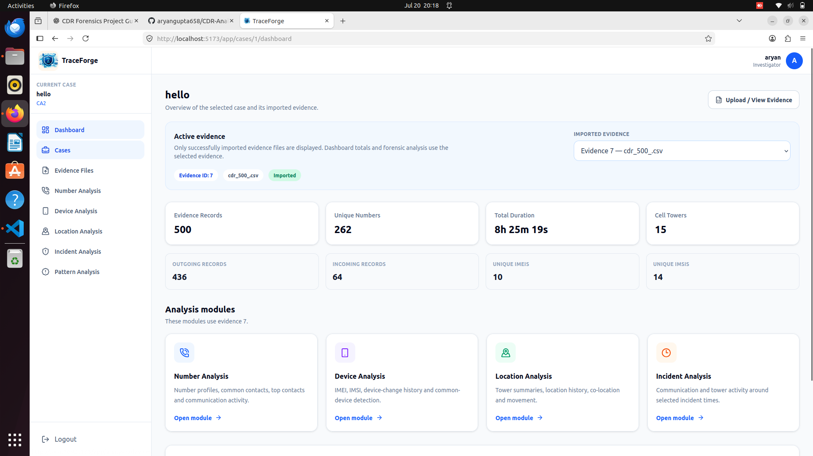

### Number Analysis

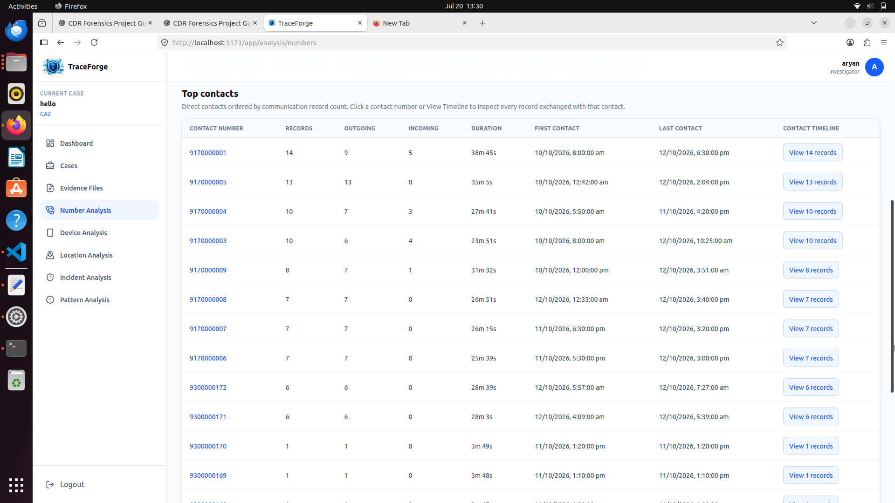
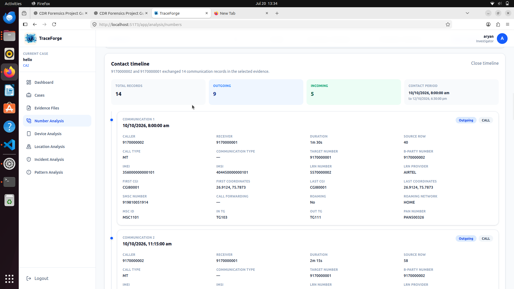
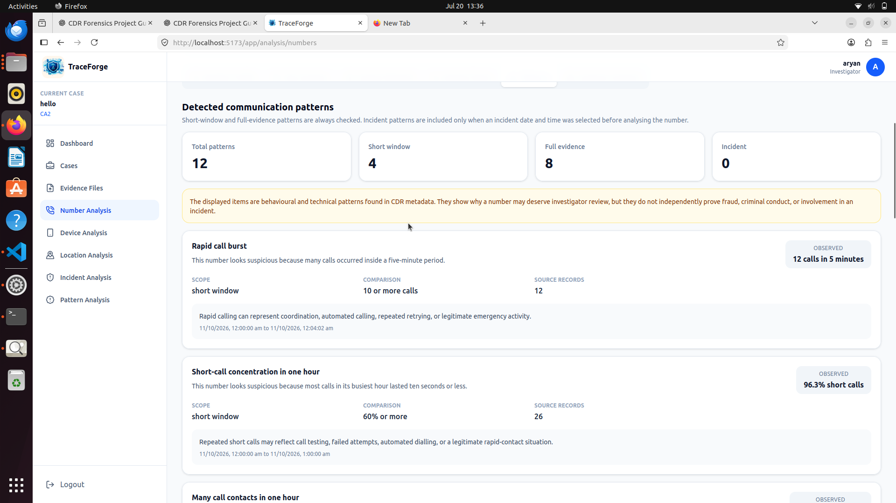

### Location Map

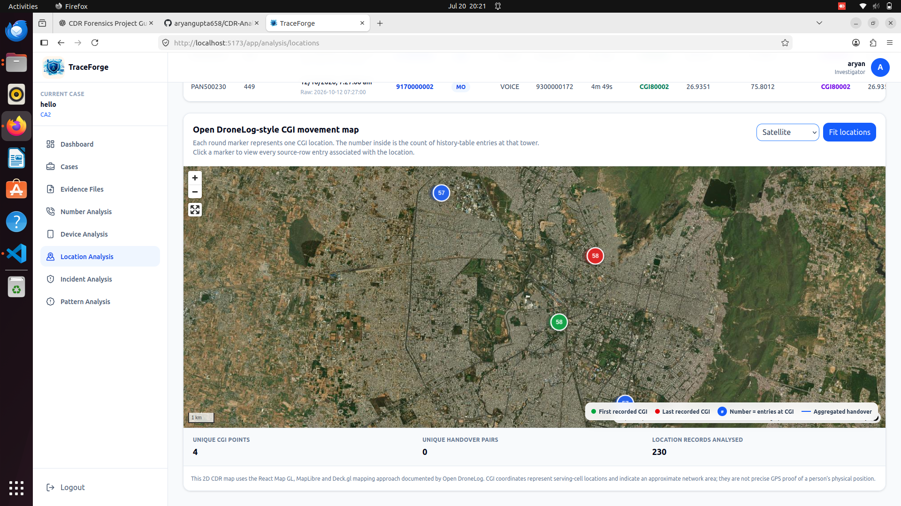
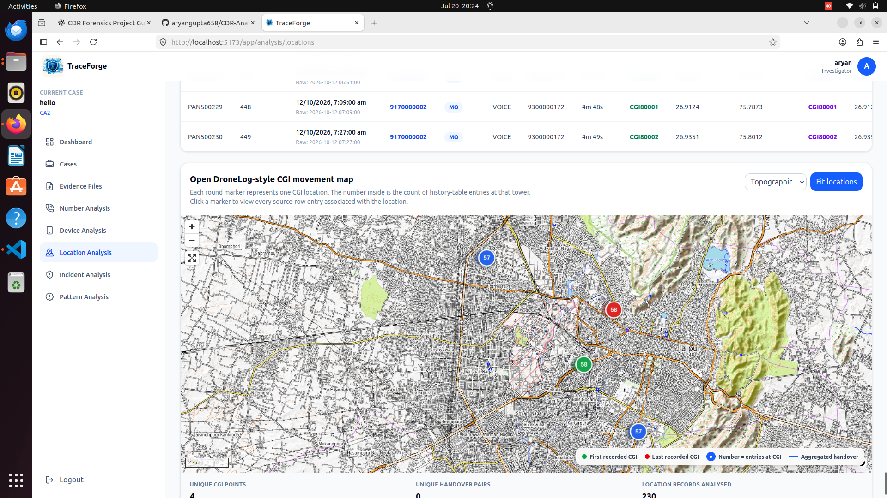

### Incident Analysis

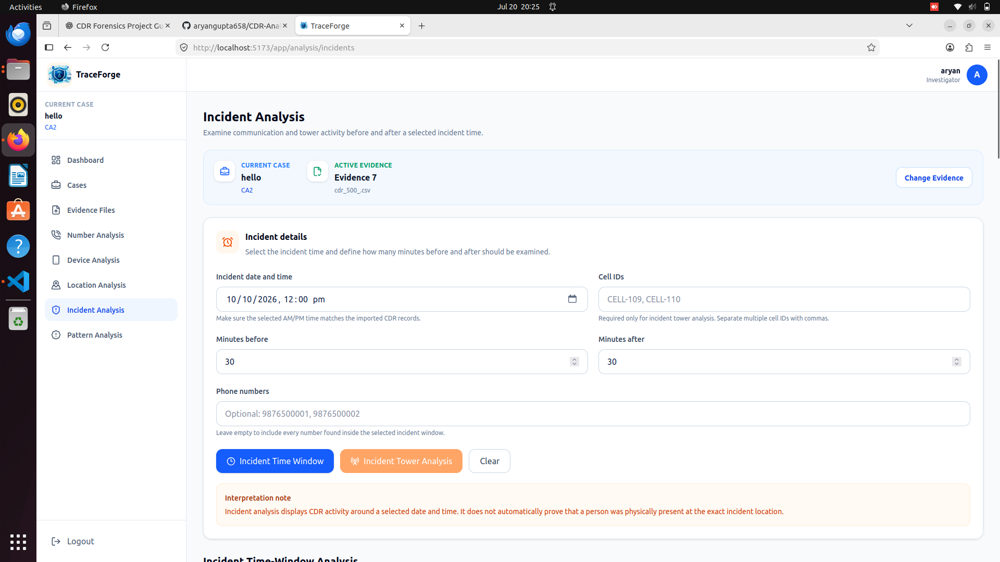
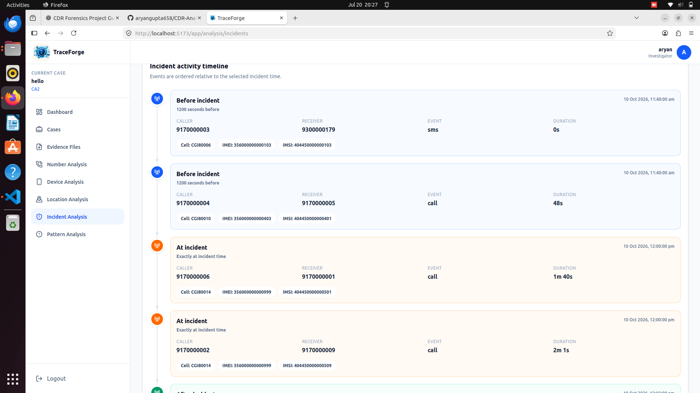
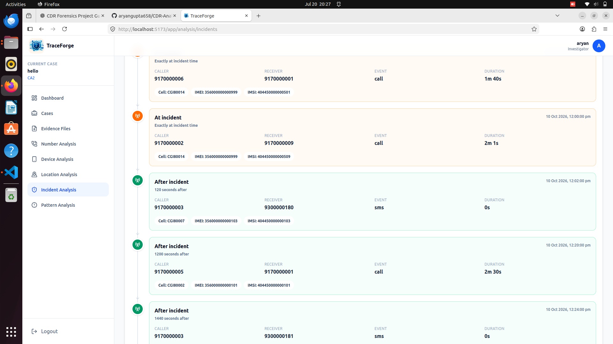

### Pattern Analysis

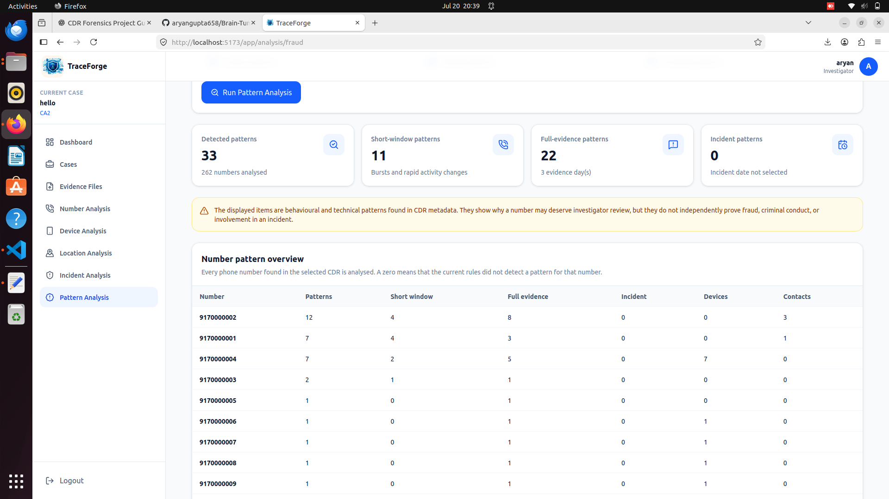
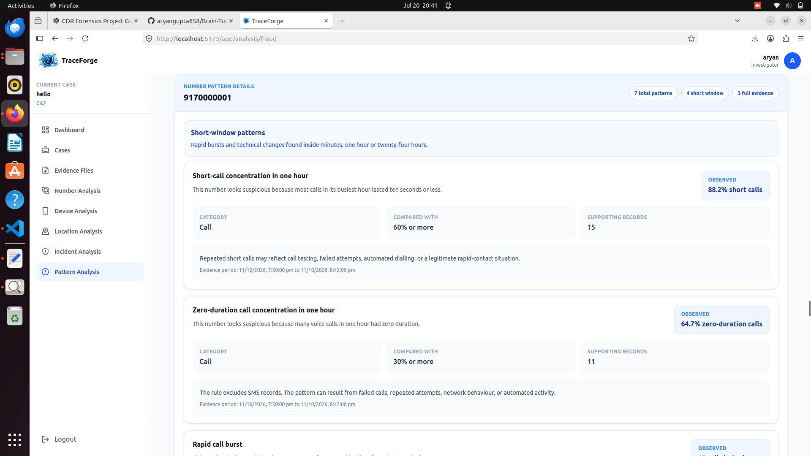

---

## Installation

### Clone the repository

```bash
git clone https://github.com/aryangupta658/CDR-Forensics-Analyzer.git
cd CDR-Forensics-Analyzer
```

### Backend

```bash
cd backend
python3 -m venv venv
source venv/bin/activate
pip install -r requirements.txt
uvicorn app.main:app --reload
```

The backend normally runs at:

```text
http://127.0.0.1:8000
```

API documentation:

```text
http://127.0.0.1:8000/docs
```

### Frontend

Open another terminal:

```bash
cd frontend
npm install
npm run dev
```

The frontend normally runs at:

```text
http://localhost:5173
```

---

## Sample Dataset

The synthetic all-features dataset can be stored at:

```text
sample-data/cdr_500_all_features.csv
```

Recommended incident settings:

```text
Incident datetime: 2026-10-11 20:00:00
Incident CGI: CGI90001
Main incident target: 9170000001
```

---

## Security and Forensic Considerations

- Authentication is required before case access.
- Every record is scoped to a case and evidence file.
- `.env`, virtual environments, uploaded evidence and local databases should not be committed.
- Phone numbers, IMEI and IMSI values should be stored as text.
- Source-row references are retained for verification.
- Tower records indicate approximate network association, not exact GPS location.
- Automated patterns are indicators, not final conclusions.
- Only authorized CDR evidence should be processed.

---

## Limitations

- Operator exports may require additional column aliases.
- SQLite is intended for development and academic-scale datasets.
- Cell-tower coordinates may be incomplete or inaccurate.
- Serving-cell association is not equivalent to exact physical location.
- Pattern thresholds may require tuning for different evidence.
- The application does not intercept live calls, messages or telecom traffic.

---

## Future Enhancements

- PostgreSQL support
- Background processing for large evidence files
- Role-based access control
- Audit logging
- Evidence hash verification
- Exportable investigation reports
- Configurable rule thresholds
- Multi-evidence correlation
- Temporal graph filtering
- Docker deployment
- Automated tests and CI/CD

---

## Author

**Aryan Gupta**

GitHub: [aryangupta658](https://github.com/aryangupta658)

---

## Disclaimer

This project is intended for educational, research and authorized forensic-analysis use. It must not be used for unauthorized surveillance, illegal access, harassment or unsupported accusations.

<div align="center">

Built for explainable CDR analysis and cyber-forensics education.

</div>
